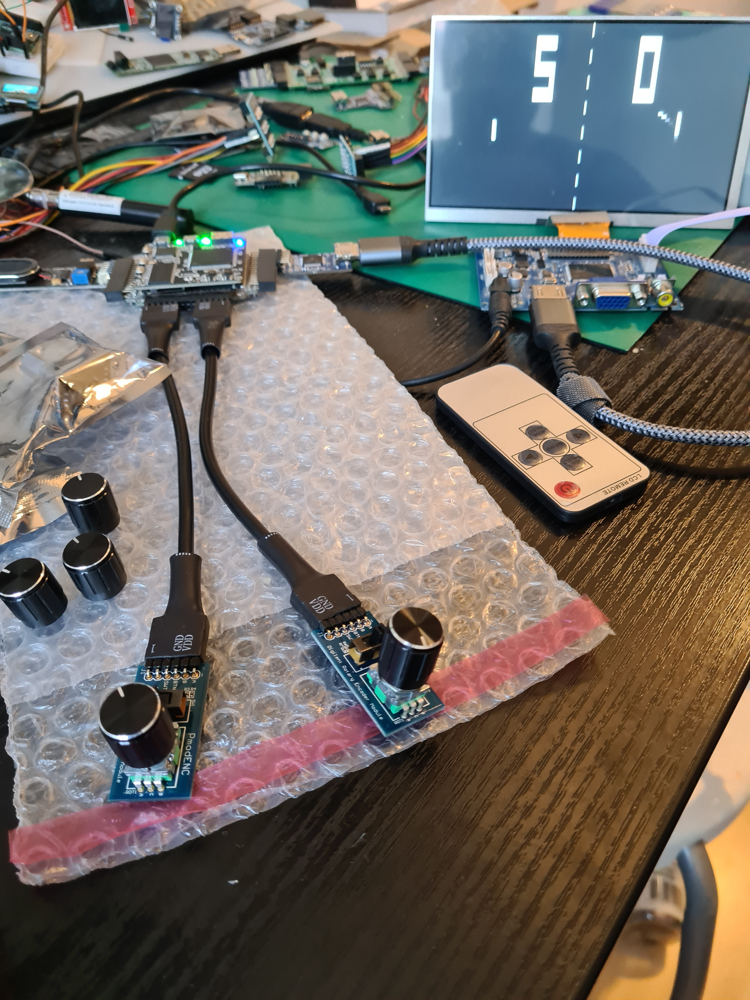

Wanted to feel how a pong could implemented. Just only proof of concept but is playable
and you can extend. And I don't care about consumed LUTs and registers.

I used:
2x rotary encoders https://digilent.com/shop/pmod-enc-rotary-encoder/
1x vga2hdmi converter https://1bitsquared.de/products/pmod-digital-video-interface
1x speaker https://es.aliexpress.com/item/1005001505255692.html

This initial version based on a blackicemx!
You can use the switch button on rotaries to activate autopilot.
You can reset scoreboard with button s2.
There are lots of localparam just play with them. You can extend the logic
with increasing speedball etc.

You can use other parts with small adjustments or direct a vga pmod!

Have fun!

Hirosh

